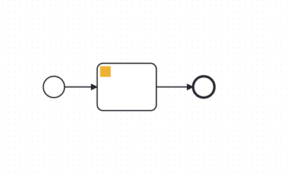

> A Connector template for new C8 outbound connector
>
> To use this template update the following resources to match the name of your connector:
>
> * [README](./README.md) (title, description)
> * [Element Template](./element-templates/template-connector.json)
> * [POM](./pom.xml) (artifact name, id, description)
> * [Connector Function](src/main/java/io/camunda/example/MyConnectorFunction.java) (rename, implement, update
    `OutboundConnector` annotation)
> * [Service Provider Interface (SPI)](./src/main/resources/META-INF/services/io.camunda.connector.api.outbound.OutboundConnectorFunction) (
    rename)
>
>
> about [creating Connectors](https://docs.camunda.io/docs/components/connectors/custom-built-connectors/connector-sdk/#creating-a-custom-connector)
>
> Check out the [Connectors SDK](https://github.com/camunda/connectors)

# Connector Template

Camunda Outbound Connector Template

Emulates a simple outbound connector function that takes a message and echoes it back.

The function will throw an exception if your message starts with `fail`. This can be used to test error handling.

## Build

You can package the Connector by running the following command:

```bash
mvn clean package
```

This will create the following artifacts:

- A thin JAR without dependencies.
- A fat JAR containing all dependencies, potentially shaded to avoid classpath conflicts. This will not include the SDK
  artifacts since those are in scope `provided` and will be brought along by the respective Connector Runtime executing
  the Connector.

### Shading dependencies

You can use the `maven-shade-plugin` defined in the [Maven configuration](./pom.xml) to relocate common dependencies
that are used in other Connectors and
the [Connector Runtime](https://github.com/camunda/connectors).
This helps to avoid classpath conflicts when the Connector is executed.

Use the `relocations` configuration in the Maven Shade plugin to define the dependencies that should be shaded.
The [Maven Shade documentation](https://maven.apache.org/plugins/maven-shade-plugin/examples/class-relocation.html)
provides more details on relocations.

## API

### Input

| Name     | Description      | Example           | Notes                                                                      |
|----------|------------------|-------------------|----------------------------------------------------------------------------|
| username | Mock username    | `alice`           | Has no effect on the function call outcome.                                |
| token    | Mock token value | `my-secret-token` | Has no effect on the function call outcome.                                |
| message  | Mock message     | `Hello World`     | Echoed back in the output. If starts with 'fail', an error will be thrown. |

### Output

```json
{
  "result":{
    "myProperty":"Message received: ..."
  }
}
```

### Error codes

| Code | Description                                |
|------|--------------------------------------------|
| FAIL | Message starts with 'fail' (ignoring case) |

## Test locally

Run unit tests

```bash
mvn clean verify
```

### Test with local runtime

To ensure the seamless functionality of your custom Camunda connector, please follow the steps below:

#### Prerequisites:

1. Camunda Modeler, which is available in two variants:
    - [Desktop Modeler](https://camunda.com/download/modeler/) for a local installation.
    - [Web Modeler](https://camunda.com/download/modeler/) for an online experience.

2. [Docker](https://www.docker.com/products/docker-desktop), which is required to run the Camunda platform.

#### Setting Up the Environment:

1. Clone the Camunda Platform repository from GitHub:

```shell
git clone https://github.com/camunda/camunda-platform.git
```

Navigate to the cloned directory and open docker-compose-core.yaml with your preferred text editor.

Locate the connector image section and comment it out using the # symbol, as you will be executing your connector
locally.

Initiate the Camunda suite with the following Docker command:

```shell
docker compose -f docker-compose-core.yaml up
```

### Configuring Camunda Modeler

1. Install the Camunda Modeler if not already done.
2. Add the `element-templates/template-connector.json` to your Modeler configuration as per
   the [Element Templates documentation](https://docs.camunda.io/docs/components/modeler/desktop-modeler/element-templates/configuring-templates/).

### Launching Your Connector

1. Run `io.camunda.example.LocalConnectorRuntime` to start your connector.
2. Create and initiate a process that utilizes your newly created connector within the Camunda Modeler. 
3. Verify that the process is running smoothly by accessing Camunda Operate at [localhost:8081](http://localhost:8081).

Follow these instructions to test and use your custom Camunda connector effectively.

### Test with SaaS

#### Setting Up the Environment:

1. Navigate to Camunda [SaaS](https://console.camunda.io).
2. Create a cluster using the latest version available.
3. Select your cluster, then go to the `API` section and click `Create new Client`.
4. Ensure the `zeebe` checkbox is selected, then click `Create`.
5. Copy the configuration details displayed under the `Spring Boot` tab.
6. Paste the copied configuration into your `application.properties` file within your project.

### Launching Your Connector

1. Start your connector by executing `io.camunda.example.LocalConnectorRuntime` in your development environment.
2. Access the Web Modeler and create a new project.
3. Click on `Create new`, then select `Upload files`. Upload the connector template from the repository you have.
4. In the same folder, create a new BPMN diagram.
5. Design and start a process that incorporates your new connector.

By adhering to these steps, you can validate the integration of your custom Camunda connector with the SaaS environment.

## Element Template

The element template for this sample connector is generated automatically based on the connector
input class using
the [Element Template Generator](https://github.com/camunda/connectors/tree/main/element-template-generator/core).

The generation is embedded in the Maven build and can be triggered by running `mvn clean package`.

The generated element template can be found
in [element-templates/template-connector.json](./element-templates/template-connector.json).
