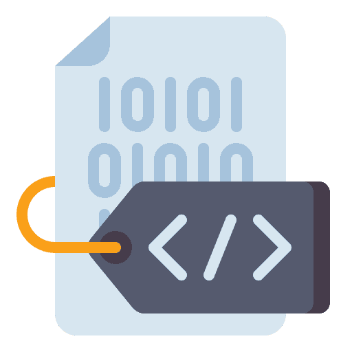

# Task Information Connector

Automated task discovery and monitoring for Camunda 8 process instances.
This connector retrieves active human task metadata directly from Camunda Operate and Tasklist APIs, ensuring real-time process visibility and seamless automation.

# Overview

The Task Information Connector automates the retrieval and monitoring of active tasks within Camunda 8 process instances.
It securely interacts with the Camunda Operate and Tasklist APIs, authenticated via Keycloak, to detect and return metadata for available human tasks based on the current state of a process instance.

By continuously checking task readiness and navigating through subprocess chains when necessary, the connector eliminates manual queries or complex API integrations.
It provides a unified and real-time view of process execution, enabling external systems and automation workflows to act based on precise and up-to-date process data.

# Key Features

Automatic Task Detection – Retrieves task metadata dynamically based on process instance and state (e.g., CREATED, CANCELED).

Subprocess Navigation – Automatically follows subprocess chains, maintaining visibility even after parent processes complete.

Plug-and-Play Architecture – Easily integrated and reusable across multiple Camunda BPMN models.

Secure Authentication – Interacts with Camunda APIs using Keycloak-based token authentication.

Smart Waiting Mechanism – Implements a controlled polling loop to detect task readiness efficiently.

Lightweight REST Interface – Designed for fast integration with external systems and connectors.

Architecture Overview
┌─────────────────────────────────────────────┐
│          Task Information Connector          │
│─────────────────────────────────────────────│
│   1. Receives Process Instance ID            │
│   2. Authenticates via Keycloak              │
│   3. Queries Camunda Operate for state        │
│   4. Checks Tasklist for active user tasks    │
│   5. Returns task metadata to client system   │
└─────────────────────────────────────────────┘

# Dependencies:
- Camunda 8 (Operate + Tasklist)
- Keycloak for authentication

⚙️ Configuration

Set the following environment variables in your configuration file or runtime environment:

Variable	Description	Example
OPERATE_BASE_URL	Camunda Operate base URL	http://localhost:8081/v1/process-instances
TASKLIST_BASE_URL	Camunda Tasklist base URL	http://localhost:8082/v1
KEYCLOAK_TOKEN_URL	Keycloak token endpoint	http://localhost:18080
KEYCLOAK_CLIENT_ID	Client ID for authentication	camunda-client
KEYCLOAK_CLIENT_SECRET	Client secret for authentication	abc123xyz
CONNECTOR_TIMEOUT	Timeout for task readiness waiting (ms)	30000

# How It Works

The connector receives the process instance ID and state.

It requests an access token from Keycloak.

Using the token, it queries Camunda Operate for the process status.

If a human task is available, it retrieves detailed metadata from the Tasklist API.

Returns the formatted metadata to the caller system.

If no active task exists, the connector waits until one becomes available (configurable).

  Use Cases

  Workflow Orchestration: Trigger actions in external systems based on user task events.

  Process Monitoring: Retrieve task details for dashboards or analytics.

  Decision Automation: Feed real-time task data into AI-driven decision logic.

  Notifications: Send alerts or emails when tasks reach a certain state.

#  Build & Run
Prerequisites

Java 21+

Maven 3.8+

Running Camunda 8 environment (Operate + Tasklist)

Keycloak configured for authentication

Build
mvn clean package

Run
java -jar task-info-connector.jar

#  License

This project is licensed under the MIT License — feel free to use, modify, and distribute.

  SEO Description

Task Information Connector for Camunda 8 — Automate task discovery, monitoring, and metadata retrieval from Camunda Operate and Tasklist APIs. Securely authenticated via Keycloak, this connector delivers real-time process insights for workflow orchestration and automation.